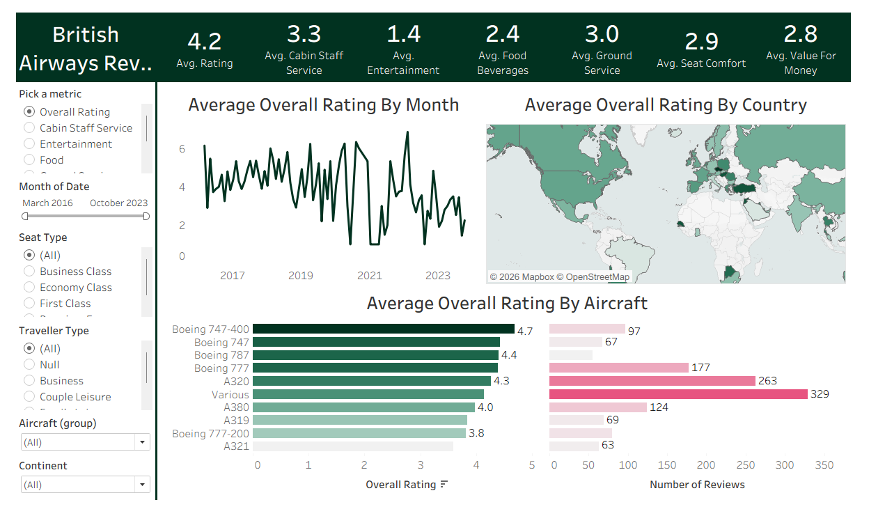

# ✈️ British Airways Reviews — Tableau Dashboard

An interactive Tableau data visualization project built to analyze British Airways customer reviews and understand how passengers evaluate different aspects of their travel experience.

The workbook combines customer ratings, time-based analysis, geographic analysis, aircraft-level comparisons, and interactive filters into a single dashboard.

---

## 📊 Dashboard Preview

---

## 🎯 Project Objective

The objective of this project is to turn British Airways customer-review data into an interactive dashboard that makes it easier to explore:

- Overall customer ratings
- Cabin staff service
- Entertainment
- Food and beverages
- Ground service
- Seat comfort
- Value for money
- Changes in ratings over time
- Ratings by country
- Ratings and review counts by aircraft
- Differences between seat types and traveller types

---

## 🖥️ Dashboard Structure

The Tableau workbook contains the following main sheets and dashboard components.

### 1. 📈 Month

**Sheet: Month**

This sheet provides the time-series view of customer experience.

It shows:

- Average selected metric by month
- Rating trends across the review period
- Changes in customer experience over time

The dashboard uses the **Pick a metric** parameter to switch between:

- Overall Rating
- Cabin Staff Service
- Entertainment
- Food
- Ground Service
- Seat Comfort
- Value for Money

### 2. 🌍 Map

**Sheet: Map**

The map provides a geographic view of customer ratings.

It is used to explore:

- Average rating by country
- Geographic differences in customer experience
- Countries represented in the review dataset

### 3. ✈️ Aircraft

**Sheet: Aircraft**

The aircraft analysis compares customer ratings across aircraft groups.

It includes:

- Aircraft type
- Average selected rating
- Number of reviews
- Aircraft-level comparison

### 4. 📋 Summary

**Sheet: summary**

The summary sheet supports the dashboard's overall KPI and metric presentation.

It works with dimensions and measures including:

- Aircraft
- Date
- Rating
- Cabin Staff Service
- Entertainment
- Food & Beverages
- Ground Service
- Seat Comfort
- Value for Money
- Seat Type
- Traveller Type
- Place

### 5. 🧩 Dashboard 1

**Dashboard: Dashboard 1**

This is the main interactive dashboard combining the individual Tableau sheets.

Interactive controls include:

- Pick a metric
- Month of Date
- Seat Type
- Traveller Type
- Aircraft group
- Continent

The dashboard combines the time-series, geographic, aircraft and KPI views into one analysis experience.

---

## 🔎 Key Dashboard Metrics

The dashboard presents KPI cards for major customer-experience measures.

| Metric | Description |
|---|---|
| ⭐ Overall Rating | Average overall customer rating |
| 👨‍✈️ Cabin Staff Service | Average cabin staff service rating |
| 🎬 Entertainment | Average entertainment rating |
| 🍽️ Food & Beverages | Average food/beverage rating |
| 🛬 Ground Service | Average ground-service rating |
| 💺 Seat Comfort | Average seat-comfort rating |
| 💰 Value for Money | Average value-for-money rating |

---

## 🎛️ Interactive Filters

The dashboard contains multiple filters for deeper analysis.

### Metric Parameter
Switch between different customer-experience metrics.

### Date Range
Explore reviews across different periods.

### Seat Type
Compare available seat classes such as Business Class, Economy Class and First Class.

### Traveller Type
Analyze different traveller segments.

### Aircraft Group
Filter the dashboard to specific aircraft groups.

### Continent
Explore customer feedback by geographic region.

---

## 📁 Dataset

### ba_reviews.csv

The primary customer-review dataset.

Important fields represented in the Tableau workbook include:

- Date
- Rating
- Cabin Staff Service
- Entertainment
- Food & Beverages
- Ground Service
- Seat Comfort
- Value for Money
- Aircraft
- Seat Type
- Traveller Type
- Place

### Countries.csv

Supporting country/reference data used for geographic analysis and mapping.

---

## 🛠️ Tools & Technologies

- Tableau
- CSV
- Data Visualization
- Exploratory Data Analysis

---

## 📂 Project Structure

    British-Airways-Review-Tableau/
    ├── ba_reviews.csv
    ├── Countries.csv
    ├── British Airways Reviews Tableau Dashboard.twbx
    ├── dashboard.png
    └── README.md

---

## ▶️ How to Use

1. Clone or download this repository.
2. Open **British Airways Reviews Tableau Dashboard.twbx** in Tableau Desktop.
3. Open **Dashboard 1**.
4. Use the metric selector and filters.
5. Explore the Month, Map, Aircraft and Summary views.
6. Change filters to investigate different customer segments and aircraft groups.

---

## 📌 What This Project Demonstrates

This project demonstrates practical skills in:

- Tableau dashboard development
- Data visualization
- KPI design
- Geographic visualization
- Time-series analysis
- Customer-review analysis
- Interactive filtering
- Parameter-driven dashboards
- Aircraft-level comparison
- Business-oriented data storytelling

---

## 👤 Author

**Yash Sharma**

Data Analytics / Data Visualization Project

---

⭐ Explore the workbook and experiment with the dashboard filters.
